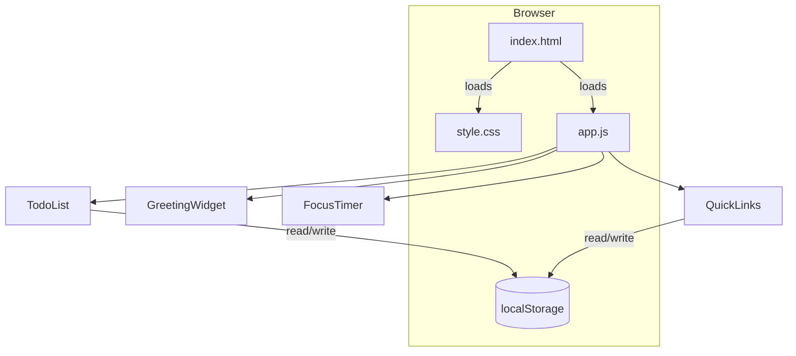

# Design Document

## Overview

Todo List Life Dashboard adalah web app produktivitas berbasis browser yang berjalan sepenuhnya di sisi klien. Tidak ada backend, tidak ada framework, tidak ada proses build — cukup buka satu HTML file dan aplikasi langsung siap digunakan.

Aplikasi menampilkan empat widget dalam satu halaman:
- **Greeting_Widget** — jam real-time, tanggal, dan sapaan kontekstual berdasarkan waktu hari
- **Focus_Timer** — countdown Pomodoro 25 menit dengan kontrol Start/Stop/Reset
- **Todo_List** — manajemen tugas dengan operasi CRUD penuh
- **Quick_Links** — pintasan ke URL favorit yang tersimpan persisten

Semua data (tugas dan tautan) disimpan di Browser Local Storage. Aplikasi harus bekerja via `file://` di Chrome, Firefox, Edge, dan Safari versi 2020+, merespons setiap aksi pengguna < 100ms, dan me-render awal < 2 detik.

---

## Architecture

### Struktur File

```
todo-list-life-dashboard/
├── index.html        # Entry point tunggal — markup semua widget
├── style.css         # Satu-satunya file CSS (layout, tema, responsif)
└── app.js            # Satu-satunya file JS (semua logika widget)
```

Tidak ada dependensi eksternal. Tidak ada CDN. Tidak ada node_modules.

### Pola Arsitektur

Arsitektur menggunakan **Module Pattern** berbasis IIFE (Immediately Invoked Function Expression) dan namespace global tunggal (`Dashboard`). Setiap widget direpresentasikan sebagai modul mandiri dengan tanggung jawab tunggal.

```
app.js
└── Dashboard (global namespace)
    ├── Storage      — wrapper tipis di atas localStorage
    ├── GreetingWidget
    ├── FocusTimer
    ├── TodoList
    └── QuickLinks
```

Komunikasi antar-modul dilakukan melalui event DOM standar atau pemanggilan langsung — tidak ada state management terpusat karena fitur-fitur ini independen satu sama lain.

### Alur Data

```
User Action → DOM Event → Widget Module → Storage.save() → localStorage
                                       ↓
                                  DOM Update (< 100ms)
```

Pada saat halaman dimuat:
```
DOMContentLoaded → Storage.load() → localStorage → Widget.render()
```

### Diagram Arsitektur



---

## Components and Interfaces

### 1. Storage Module

Bertanggung jawab atas semua interaksi dengan `localStorage`. Modul ini mengisolasi akses storage sehingga widget tidak perlu menangani serialisasi/deserialisasi secara langsung.

```javascript
Storage = {
  save(key, data)     // JSON.stringify + localStorage.setItem; throws StorageError on failure
  load(key)           // JSON.parse + localStorage.getItem; returns null on missing/corrupt data
  remove(key)         // localStorage.removeItem
}
```

**Storage Keys:**
- `dashboard_tasks` — array of Task objects
- `dashboard_links` — array of Link_Item objects

**Error Handling:** Jika `localStorage.setItem` melempar exception (misalnya QuotaExceededError), Storage module menangkapnya dan melempar ulang sebagai `StorageError` agar widget dapat menampilkan pesan kesalahan ke pengguna.

---

### 2. GreetingWidget

Menampilkan waktu real-time, tanggal, dan sapaan kontekstual. Tidak ada data yang disimpan ke storage.

**Interface:**
```javascript
GreetingWidget = {
  init()              // Render awal + jalankan interval 1 detik
  _tick()             // Hitung waktu/tanggal/greeting sekarang, update DOM
  _getGreeting(hour)  // Kembalikan string sapaan berdasarkan jam (0–23)
  _formatTime(date)   // Kembalikan string HH:MM:SS
  _formatDate(date)   // Kembalikan string "Nama Hari, D Bulan YYYY" dalam Bahasa Indonesia
}
```

**Pemetaan Time_of_Day:**
| Rentang Jam | Sapaan |
|---|---|
| 05:00 – 11:59 | Selamat Pagi |
| 12:00 – 14:59 | Selamat Siang |
| 15:00 – 17:59 | Selamat Sore |
| 18:00 – 04:59 | Selamat Malam |

**Implementasi:**
- `setInterval(() => this._tick(), 1000)` dipanggil saat `init()`
- `_tick()` memanggil `new Date()` setiap detik — tidak ada state jam tersimpan
- Perubahan greeting otomatis terdeteksi saat `_tick()` berjalan (maks. keterlambatan 60 detik sesuai requirement 2.6)

---

### 3. FocusTimer

Countdown timer 25 menit. State timer (apakah sedang berjalan, sisa detik) disimpan hanya di memori — tidak perlu persisten ke localStorage karena timer dimaksudkan untuk sesi aktif.

**Interface:**
```javascript
FocusTimer = {
  init()              // Render UI, bind event listeners
  start()             // Mulai countdown via setInterval
  stop()              // Hentikan countdown, pertahankan nilai sisa
  reset()             // Hentikan countdown, set _remaining ke 1500
  _tick()             // Kurangi _remaining, update DOM, cek apakah 0
  _updateDisplay()    // Format _remaining ke MM:SS, tulis ke DOM
  _onComplete()       // Tampilkan pesan selesai, atur ulang state tombol
  _setButtonStates(running) // Aktif/nonaktifkan tombol Start & Stop
}
```

**State Internal:**
```javascript
{
  _remaining: 1500,   // detik tersisa (1500 = 25 menit)
  _intervalId: null,  // ID dari setInterval yang berjalan
  _running: false
}
```

**Presisi Timer:**
Menggunakan `Date.now()` untuk mengukur elapsed time aktual saat setiap tick, bukan semata-mata mengandalkan counter. Ini mencegah drift kumulatif yang melebihi ±0.1 detik per tick (requirement 3.2).

**State tombol:**
| Status Timer | Start | Stop |
|---|---|---|
| Idle/Reset | Aktif | Nonaktif |
| Berjalan | Nonaktif | Aktif |
| Selesai (00:00) | Aktif | Nonaktif |

---

### 4. TodoList

Manajemen daftar tugas dengan operasi CRUD lengkap.

**Interface:**
```javascript
TodoList = {
  init()                          // Load dari storage, render, bind events
  _loadTasks()                    // Baca dari Storage.load('dashboard_tasks')
  _saveTasks()                    // Tulis ke Storage.save('dashboard_tasks', tasks)
  _render()                       // Render ulang seluruh daftar Task dari _tasks[]
  _renderTask(task)               // Kembalikan DOM element untuk satu Task
  addTask(text)                   // Validasi, buat Task baru, simpan, render
  editTask(id, newText)           // Validasi, update Task, simpan, render
  toggleTask(id)                  // Toggle completed, simpan, render
  deleteTask(id)                  // Tampilkan konfirmasi, hapus jika dikonfirmasi, simpan, render
  _validateTaskText(text, maxLen) // Kembalikan { valid: bool, error: string }
  _showError(element, message)    // Tampilkan pesan error di dekat element
}
```

**Operasi Edit Inline:**
Saat pengguna klik tombol edit atau double-click teks task:
1. Teks task diganti dengan `<input>` yang sudah terisi teks lama
2. Event `keydown` mendengar Enter (simpan) dan Escape (batal)
3. Tombol simpan/batal ditampilkan inline

---

### 5. QuickLinks

Manajemen tautan favorit.

**Interface:**
```javascript
QuickLinks = {
  init()                          // Load dari storage, render, bind events
  _loadLinks()                    // Baca dari Storage.load('dashboard_links')
  _saveLinks()                    // Tulis ke Storage.save('dashboard_links', links)
  _render()                       // Render ulang semua Link_Item
  _renderLink(link)               // Kembalikan DOM element untuk satu Link_Item
  addLink(label, url)             // Validasi, tambah Link_Item, simpan, render
  deleteLink(id)                  // Hapus Link_Item, simpan, render
  _validateLink(label, url)       // Kembalikan { valid: bool, errors: {label?, url?} }
  _showFieldError(field, message) // Tampilkan error di bawah field yang gagal validasi
}
```

**Validasi URL:**
- Harus merupakan URL absolut dengan skema `http://` atau `https://`
- Validasi menggunakan `new URL(input)` — jika melempar exception, URL dianggap tidak valid
- Cek skema: `url.protocol === 'http:' || url.protocol === 'https:'`

**Batas kapasitas:** Maksimal 50 Link_Item. Tombol tambah dinonaktifkan / form ditolak jika sudah mencapai batas.

---

## Data Models

### Task

```javascript
{
  id: string,           // UUID v4 — unik per task, dibuat saat penambahan
  text: string,         // Deskripsi tugas, 1–500 karakter (tambah), 1–255 karakter (edit)
  completed: boolean,   // Status selesai
  createdAt: number     // Unix timestamp ms (Date.now()) saat task dibuat — untuk pengurutan
}
```

**Catatan:** Batas karakter berbeda untuk tambah (500) dan edit (255) sesuai requirement 4.2 dan 5.3.

### Link_Item

```javascript
{
  id: string,           // UUID v4 — unik per link, dibuat saat penambahan
  label: string,        // Nama tampilan tautan, 1–100 karakter
  url: string,          // URL absolut http/https, maks. 2048 karakter
  createdAt: number     // Unix timestamp ms — untuk pengurutan tampilan
}
```

### Storage Schema

```javascript
// localStorage['dashboard_tasks']
{
  version: 1,
  tasks: Task[]
}

// localStorage['dashboard_links']
{
  version: 1,
  links: Link_Item[]
}
```

Field `version` disiapkan untuk migrasi data di masa depan jika struktur berubah.

### UUID Generation

Menggunakan `crypto.randomUUID()` yang tersedia di semua browser modern (Chrome 92+, Firefox 95+, Safari 15.4+, Edge 92+) — semua memenuhi kriteria "browser 2020+". Jika tidak tersedia sebagai fallback, gunakan `Math.random()`-based UUID sederhana.

---

## Correctness Properties


*A property is a characteristic or behavior that should hold true across all valid executions of a system — essentially, a formal statement about what the system should do. Properties serve as the bridge between human-readable specifications and machine-verifiable correctness guarantees.*

### Property 1: Format waktu selalu HH:MM:SS

*For any* `Date` object, `_formatTime(date)` SHALL menghasilkan string yang cocok dengan pola `/^\d{2}:\d{2}:\d{2}$/` dengan nilai jam, menit, dan detik yang tepat sesuai nilai dari `Date` tersebut.

**Validates: Requirements 1.1**

---

### Property 2: Format tanggal dalam Bahasa Indonesia

*For any* `Date` object, `_formatDate(date)` SHALL menghasilkan string yang mengandung nama hari dalam Bahasa Indonesia yang benar, angka tanggal, nama bulan dalam Bahasa Indonesia yang benar, dan tahun yang sesuai dengan `Date` tersebut.

**Validates: Requirements 1.2**

---

### Property 3: Pemetaan sapaan mencakup semua jam (0–23)

*For any* integer jam `h` dalam rentang [0, 23], `_getGreeting(h)` SHALL menghasilkan tepat satu dari empat string — "Selamat Pagi" (h ∈ [5, 11]), "Selamat Siang" (h ∈ [12, 14]), "Selamat Sore" (h ∈ [15, 17]), atau "Selamat Malam" (h ∈ [18, 23] ∪ [0, 4]) — dan tidak ada jam yang tidak tertangani.

**Validates: Requirements 2.1, 2.2, 2.3, 2.4**

---

### Property 4: Format timer selalu MM:SS

*For any* integer `seconds` dalam rentang [0, 1500], fungsi format timer SHALL menghasilkan string yang cocok dengan pola `/^\d{2}:\d{2}$/` dengan nilai menit dan detik yang secara matematis benar (`Math.floor(seconds / 60)` dan `seconds % 60`).

**Validates: Requirements 3.3**

---

### Property 5: Penambahan task valid membuat task baru dan mengosongkan input

*For any* string non-kosong dengan panjang 1–500 karakter, `addTask(text)` SHALL menambahkan tepat satu task baru ke `_tasks[]` dengan teks yang tepat sama, status `completed = false`, dan menyimpannya ke Local_Storage. Setelah operasi berhasil, input field SHALL kosong.

**Validates: Requirements 4.2, 4.3**

---

### Property 6: Input kosong atau hanya spasi ditolak saat penambahan task

*For any* string yang kosong atau hanya terdiri dari karakter spasi/whitespace, `addTask(text)` SHALL menolak penambahan (panjang `_tasks[]` tidak berubah), tidak menyimpan ke Local_Storage, dan SHALL menampilkan pesan kesalahan.

**Validates: Requirements 4.4**

---

### Property 7: Round-trip penyimpanan task mempertahankan semua data

*For any* array task dengan properti id, text, completed, dan createdAt yang beragam, menyimpan array tersebut ke Local_Storage dan kemudian memuatnya kembali melalui `_loadTasks()` SHALL menghasilkan array yang identik (sama id, text, status completed, dan urutan berdasarkan `createdAt` dari terlama ke terbaru).

**Validates: Requirements 4.5, 6.4, 8.2**

---

### Property 8: Mode edit menampilkan teks task yang sudah ada sebagai pre-fill

*For any* task dengan teks apapun, memulai mode edit pada task tersebut SHALL menampilkan input field yang sudah terisi teks task tersebut secara tepat sama (tidak dipotong, tidak dimodifikasi).

**Validates: Requirements 5.2**

---

### Property 9: Validasi edit task

*For any* task yang ada dan any string valid (panjang 1–255 karakter, tidak hanya spasi), `editTask(id, newText)` SHALL memperbarui teks task menjadi `newText` dan menyimpan ke Local_Storage. Sebaliknya, *for any* string yang kosong, hanya spasi, atau melebihi 255 karakter, `editTask(id, invalidText)` SHALL membatalkan perubahan dan teks task SHALL tetap sama seperti sebelumnya.

**Validates: Requirements 5.3, 5.4, 5.6**

---

### Property 10: Toggle task adalah operasi round-trip

*For any* task dengan status `completed` awal (true atau false), memanggil `toggleTask(id)` dua kali secara berurutan SHALL menghasilkan task kembali ke status `completed` awal yang sama persis.

**Validates: Requirements 6.2, 6.3**

---

### Property 11: Penghapusan task menghilangkan task dari daftar dan storage

*For any* task yang ada dalam `_tasks[]`, setelah `deleteTask(id)` dikonfirmasi, task tersebut SHALL tidak ada lagi dalam `_tasks[]` dan tidak ada dalam data yang tersimpan di Local_Storage, sementara semua task lain SHALL tetap tidak berubah.

**Validates: Requirements 7.3**

---

### Property 12: Penambahan Quick Link valid menyimpan ke storage

*For any* label dengan panjang 1–100 karakter dan URL absolut valid dengan skema `http` atau `https` (panjang ≤ 2048 karakter), selama jumlah Link_Item belum mencapai 50, `addLink(label, url)` SHALL menambahkan satu Link_Item baru ke `_links[]` dengan label dan URL yang tepat sama, dan menyimpannya ke Local_Storage.

**Validates: Requirements 9.2**

---

### Property 13: Validasi URL Quick Links

*For any* string URL, fungsi `_validateLink` SHALL mengembalikan valid hanya jika string tersebut merupakan URL absolut dengan skema `http://` atau `https://` dan dapat di-parse tanpa error. *For any* string yang bukan URL absolut (relatif, tanpa skema, skema selain http/https, string kosong), validasi SHALL mengembalikan invalid dengan pesan error.

**Validates: Requirements 9.3**

---

### Property 14: Setiap Quick Link dirender sebagai tautan ke tab baru

*For any* Link_Item dengan URL apapun, `_renderLink(link)` SHALL menghasilkan elemen anchor (atau elemen yang dapat diklik) dengan atribut `href` yang sama persis dengan `link.url` dan atribut `target="_blank"`.

**Validates: Requirements 9.4**

---

### Property 15: Penghapusan Quick Link menghilangkan dari daftar dan storage

*For any* Link_Item yang ada dalam `_links[]`, setelah `deleteLink(id)` dipanggil, Link_Item tersebut SHALL tidak ada lagi dalam `_links[]` dan tidak ada dalam data yang tersimpan di Local_Storage, sementara semua Link_Item lain SHALL tetap tidak berubah.

**Validates: Requirements 9.6**

---

### Property 16: Round-trip penyimpanan Quick Links mempertahankan semua data

*For any* array Link_Item dengan id, label, url, dan createdAt yang beragam, menyimpan array tersebut ke Local_Storage dan kemudian memuatnya kembali melalui `_loadLinks()` SHALL menghasilkan array yang identik dengan urutan yang sama.

**Validates: Requirements 9.7**

---

## Error Handling

### Strategi Umum

Semua error ditangani dengan prinsip **fail gracefully — never crash, always inform**:

1. **Storage failures** (QuotaExceededError, SecurityError): Tangkap di Storage module, propagate sebagai `StorageError`. Widget menangkap dan menampilkan pesan error inline. State tampilan tidak diubah (rollback atau tidak jadi update).
2. **Corrupt localStorage data**: `Storage.load()` membungkus `JSON.parse` dalam try-catch. Jika parse gagal, kembalikan `null`. Widget memperlakukan null sebagai "data kosong" dan render state awal.
3. **Invalid input dari pengguna**: Validasi sinkron sebelum mutasi state. Error ditampilkan inline dekat field yang bermasalah, tidak sebagai alert/dialog.
4. **crypto.randomUUID unavailable**: Fallback ke UUID berbasis `Math.random()` untuk kompatibilitas.

### Error Messages

Semua pesan error ditampilkan dalam Bahasa Indonesia, konsisten dengan bahasa UI aplikasi. Pesan bersifat deskriptif — menjelaskan apa yang salah dan (jika relevan) bagaimana cara memperbaikinya.

| Kondisi | Pesan |
|---|---|
| Task text kosong | "Deskripsi tugas tidak boleh kosong." |
| Task text hanya spasi | "Deskripsi tugas tidak boleh hanya berisi spasi." |
| Task text > 500 karakter (tambah) | "Deskripsi tugas maksimal 500 karakter." |
| Task text > 255 karakter (edit) | "Deskripsi tugas maksimal 255 karakter." |
| Label Quick Link kosong | "Label tidak boleh kosong." |
| URL Quick Link tidak valid | "URL harus dimulai dengan http:// atau https://." |
| Quick Links sudah 50 item | "Anda sudah mencapai batas maksimum 50 tautan." |
| Storage write gagal | "Gagal menyimpan data. Silakan coba lagi." |

### Penanganan Storage Error (Detail)

```javascript
// Pola di setiap method mutasi
try {
  this._saveTasks(); // atau _saveLinks()
  this._render();    // Update DOM hanya setelah save berhasil
} catch (e) {
  if (e instanceof StorageError) {
    this._showGlobalError("Gagal menyimpan data. Silakan coba lagi.");
    // Jangan update _tasks/_links, state tetap sebelumnya
  }
}
```

---

## Testing Strategy

### Pendekatan Dual Testing

Strategi pengujian menggunakan dua lapisan komplementer:

1. **Unit Tests (example-based)** — untuk perilaku spesifik, inisialisasi, state machine transitions, dan penanganan error
2. **Property-Based Tests** — untuk validasi universal yang berlaku di seluruh ruang input

### Library yang Digunakan

- **Property-Based Testing**: [fast-check](https://fast-check.dev/) (JavaScript, berjalan di browser dan Node.js)
  - Minimum **100 iterasi** per property test
  - Mendukung arbitrary generators untuk string, integer, record, array
- **Test Runner**: [Vitest](https://vitest.dev/) atau Jest (Node.js environment)
- **DOM Testing**: [jsdom](https://github.com/jsdom/jsdom) untuk simulasi DOM tanpa browser nyata

### Unit Tests (Example-Based)

Fokus pada:
- Inisialisasi widget: verifikasi DOM awal, state awal
- State machine FocusTimer: Start → Running, Stop → Paused, Reset → Idle, Complete → Idle
- Error paths: storage failure, corrupt data, cancel edit
- UI interactions: double-click edit, Escape cancel, confirmation dialog

**Contoh:**
```javascript
// Requirement 3.1 — initial display
test('FocusTimer shows 25:00 on init', () => {
  focusTimer.init();
  expect(displayEl.textContent).toBe('25:00');
});

// Requirement 8.3 — corrupt data graceful
test('TodoList renders empty list if localStorage has corrupt JSON', () => {
  localStorage.setItem('dashboard_tasks', '{invalid json}');
  todoList.init();
  expect(taskListEl.children.length).toBe(0);
});
```

### Property-Based Tests

Setiap correctness property diimplementasikan dengan satu property test menggunakan fast-check. Setiap test dijalankan minimum 100 kali dengan input yang di-generate secara acak.

**Tag format per test:** `// Feature: todo-list-life-dashboard, Property {N}: {property_text}`

**Contoh implementasi:**

```javascript
// Property 1: Format waktu HH:MM:SS
// Feature: todo-list-life-dashboard, Property 1: Format waktu selalu HH:MM:SS
test('_formatTime returns HH:MM:SS for any date', () => {
  fc.assert(fc.property(
    fc.date({ min: new Date(2000, 0, 1), max: new Date(2099, 11, 31) }),
    (date) => {
      const result = GreetingWidget._formatTime(date);
      expect(result).toMatch(/^\d{2}:\d{2}:\d{2}$/);
      const [h, m, s] = result.split(':').map(Number);
      expect(h).toBe(date.getHours());
      expect(m).toBe(date.getMinutes());
      expect(s).toBe(date.getSeconds());
    }
  ), { numRuns: 100 });
});

// Property 3: Pemetaan sapaan mencakup semua jam
// Feature: todo-list-life-dashboard, Property 3: Pemetaan sapaan mencakup semua jam
test('_getGreeting returns correct greeting for all hours 0-23', () => {
  fc.assert(fc.property(
    fc.integer({ min: 0, max: 23 }),
    (hour) => {
      const greeting = GreetingWidget._getGreeting(hour);
      if (hour >= 5 && hour <= 11) expect(greeting).toBe('Selamat Pagi');
      else if (hour >= 12 && hour <= 14) expect(greeting).toBe('Selamat Siang');
      else if (hour >= 15 && hour <= 17) expect(greeting).toBe('Selamat Sore');
      else expect(greeting).toBe('Selamat Malam');
    }
  ), { numRuns: 100 });
});

// Property 6: Input kosong/spasi ditolak
// Feature: todo-list-life-dashboard, Property 6: Input kosong atau hanya spasi ditolak
test('addTask rejects any whitespace-only or empty string', () => {
  fc.assert(fc.property(
    fc.stringOf(fc.constantFrom(' ', '\t', '\n', '\r')),
    (whitespaceText) => {
      const initialLength = todoList._tasks.length;
      todoList.addTask(whitespaceText);
      expect(todoList._tasks.length).toBe(initialLength);
    }
  ), { numRuns: 100 });
});

// Property 10: Toggle task adalah round-trip
// Feature: todo-list-life-dashboard, Property 10: Toggle task adalah operasi round-trip
test('toggleTask twice returns to original completed state', () => {
  fc.assert(fc.property(
    fc.boolean(), // initial completed state
    (initialCompleted) => {
      const task = { id: 'test-id', text: 'Test', completed: initialCompleted, createdAt: Date.now() };
      todoList._tasks = [task];
      todoList.toggleTask('test-id');
      todoList.toggleTask('test-id');
      expect(todoList._tasks[0].completed).toBe(initialCompleted);
    }
  ), { numRuns: 100 });
});
```

### Coverage Target

| Area | Unit Tests | Property Tests |
|---|---|---|
| GreetingWidget formatting | — | Properties 1, 2, 3 |
| FocusTimer state machine | ✓ (6 scenarios) | Property 4 |
| TodoList CRUD | ✓ (error paths, init) | Properties 5, 6, 7, 8, 9, 10, 11 |
| QuickLinks CRUD | ✓ (error paths, init) | Properties 12, 13, 14, 15, 16 |
| Storage module | ✓ (failure, corrupt) | — |
| Responsiveness (< 100ms) | ✓ (performance.now check) | — |
